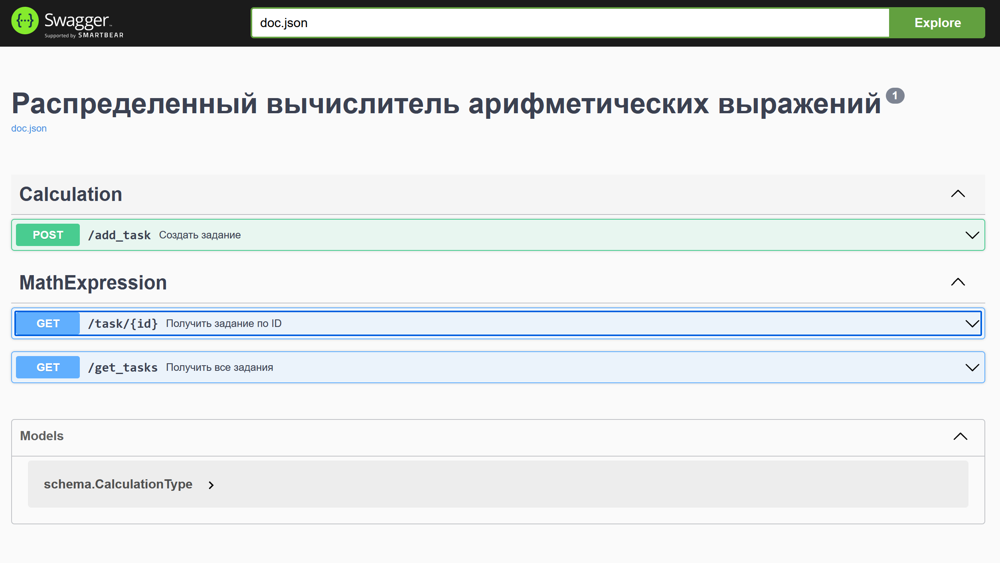
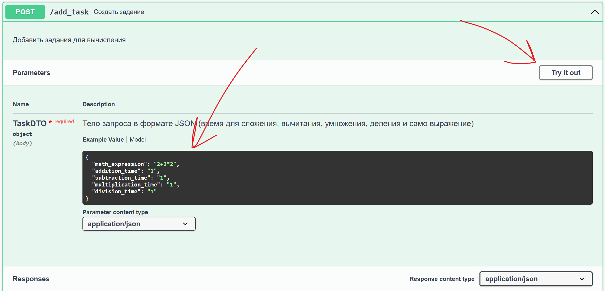
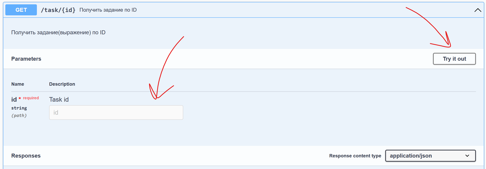
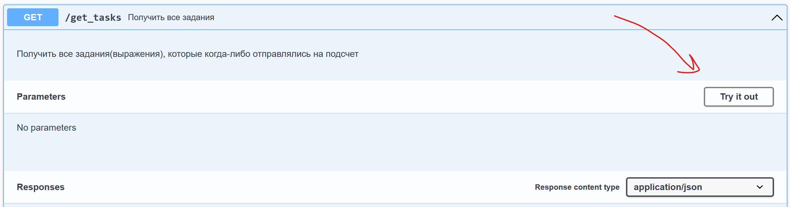

# Distributed arithmetic expression evaluator (Распределенный вычислитель арифметических выражений)
### Финальная задача к модулю №2 курса "Разработка на go" от [Яндекс Лицея](https://lyceum.yandex.ru/)

## Запуск:

_На ПК должен быть установлен и запущен [docker-desktop](https://docs.docker.com/engine/install/)_

```bash
git clone https://github.com/holodnayazvezda/DISTRIBUTED_ARITHMETIC_EXPRESSION_EVALUATOR.git
cd DISTRIBUTED_ARITHMETIC_EXPRESSION_EVALUATOR
docker-compose build
docker-compose up -d
```

## GUI (Swagger):
GUI представляет собой страницу [swagger](http://localhost:8080/swagger/index.html), которая, после запуска всех контейнеров, становится досупна по адресу http://localhost:8080/swagger/index.html

Выглядит следующим образом:


Зеленая и две синие кнопки соответсвуют трем запросам (_подробнее об отпраки запросов и интерпритации возвращаемых значений будет написано ниже_): 
* Зеленая - для **создания запроса**
* Первая синяя - для **получения информации о запросе по его id**
* Вторая синяя - для **получения всех запросов**

## Работа с запросами

* POST - **создать запрос** (то есть отправить арифметическое выражение на орбаботку)
Нажав на зеленую кнопку вы увидите приблизительно следущее:

Нажмите на кнопку "try it out", а затем отредактируйте json. В значения для полей "add_time", "dev_time", "mult_time", "sub_time" впишите числа - время в секундах, отведенных на сложение, вычитание, умножение и деление соответственно. В значения для поля "task" напишите ваше выражение, например: "2+2*2"
_Пример JSON для создания запроса:_ 
```json
{
   "math_expression": "2+2*2",
   "addition_time": "1",
   "subtraction_time": "1",
   "multiplication_time": "1",
   "division_time": "1"
}
```

после того, как вы отредактировали JSON запроса, нажмите на синию кнопку "EXECUTE".
Ответ от сервера появится под вышеупомянутой кнопкой и будет иметь следующий вид:
```json
{
  "err": null,
  "data": {
    "reqID": "d0a0f21d3d114a6f263b1306a31eb47e19883d61b9f84e0f11d1430134176a03"
  },
  "info": ""
}
```

Значение поля reqID в данном запросе - id вашего запроса (логично, логично). Используйте его для получения информации о запросе (ответа выражения)
* GET - посмотреть информацию о запросе (то есть узнать значение вашего выражения)
Нажав на первую синюю кнопку вы увидите приблизительно следущее:

Для отправки запроса, нажмите на кнопку "try it out", а затем в поле ID вставьте ID выражения, информацию о котором вы хотите получить. Затем нажмите на кнопку "EXECUTE".
Ответ от сервера появится под вышеупомянутой кнопкой и будет иметь следующий вид:
```json
{
  "err": null,
  "data": {
    "Err": "",
    "Expression": "2+2*2",
    "Req_id": "d0a0f21d3d114a6f263b1306a31eb47e19883d61b9f84e0f11d1430134176a03",
    "Res": "6",
    "Status": false,
    "ToDoTime": 2
  },
  "info": ""
}
```

Значение поля "Res" в этом JSON - результат вашего выражения. Значением поля "Res" может быть пустая строка (""), если ваше выражение содержит ошибки. В этом случае в поле Err будет текст ошибки.

Если вместо ответа сервер вернул это:
```json
{
  "err": null,
  "data": null,
  "info": "Не удалось найти запись"
}
```

то либо ваше выражение **еще не посчиталось** (еще раз выполните запрос через несколько секунд), либо **в процессе вычисления вашего выражения на сервере возникла ошибка** (что маловероятно) - попробуйте переотправить запрос создания запроса, если это не помогло, попробуйте перезапустить docker.
* GET - получить все запросы. Нажав на вторую синюю кнопку вы увидите приблизительно следущее:

Для того, чтобы выполнить этот запрос - просто нажмите на кнопку "Try it out", а затем на кнопку "Execute"
Ответ от сервера появится под вышеупомянутой кнопкой и будет иметь следующий вид:
```json
{
  "err": null,
  "data": [
    {
      "Err": "",
      "Expression": "2+5",
      "Req_id": "8bcc364beab1829748160c1e9e5a27da77b8d33f9074c001b87c8af387c55dac",
      "Res": "7",
      "Status": false,
      "ToDoTime": 1
    },
    {
      "Err": "",
      "Expression": "2+9",
      "Req_id": "34829d60c9c7fe32f62f21ff5e8da8194f8fcbef608868f2b0782fce1bc68ed6",
      "Res": "11",
      "Status": false,
      "ToDoTime": 1
    }
  ],
  "info": ""
}
```

Если вы еще не отправили ни одного запроса на создание выражений, то значением поля дата будет пустой массив ("[]").

Если для отправки запросов вы не хотите использовать swagger (gui клиент), то можете воспользоваться консольной утилитой curl.
Примеры curl для каждого из 3ех запросов: 
1. POST - посчитать выражение:
    
    ```bash
      curl -X 'POST' \
      'http://localhost:8080/add_task' \
      -H 'accept: application/json' \
      -H 'Content-Type: application/json' \
      -d '{
      "math_expression": "2+2*2",
      "addition_time": "1",
      "subtraction_time": "1",
      "multiplication_time": "1",
      "division_time": "1"
      }'
    ```
2. GET - получить выражение по id:
    
    ```bash
    curl -X 'GET' \
    'http://localhost:8080/task/your_request_id' \
    -H 'accept: application/json'
    ```
    **Не забудьте заменить your_request_id на id вашего запроса!**
3. GET - получить все выражения:
    
    ```bash
   curl -X 'GET' \
    'http://localhost:8080/tasks' \
    -H 'accept: application/json'
    ```

## ToDo

- [ ] Реализовать функционал get-запроса на состояние агентов


Контакты для связи:
- telegram: [@httpcode404](https://t.me/httpcode404)
- email: [holodnayazvezda@yandex.ru](mailto:holodnayazvezda@yandex.ru)
